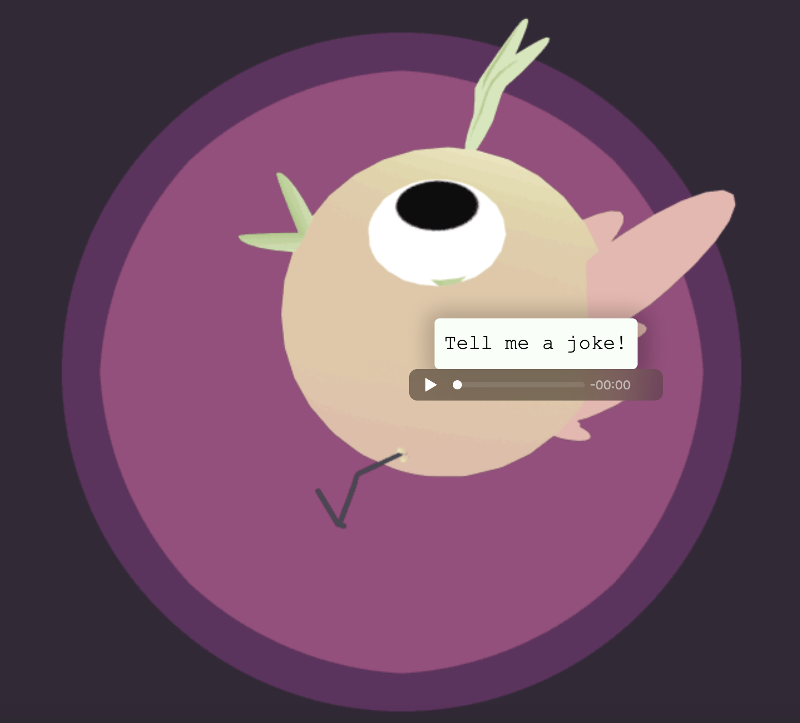

#  Joke Teller
#

Generating random geek jokes about programming, by a chicken who loves to laugh at her own jokes! 
Written using HTML5, CSS3 and JavaScript.

# Live Project
[Click here](https://selenozkan.github.io/joke-teller) to check out the live project.

### Gif source
[Click here](https://giphy.com/gifs/3d-run-bird-l44Qyujrx0ETrmqis) to access the gif source.

### Project Source
[Click here](https://www.udemy.com/course/javascript-web-projects-to-build-your-portfolio-resume/) to access the project source.
